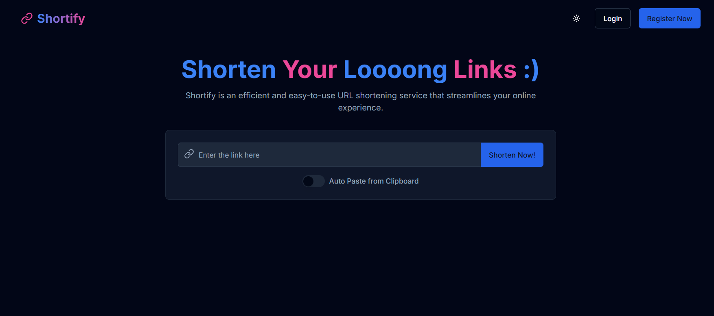

# Shortify - Modern URL Shortener

Shortify is a modern, high-performance URL shortener built with FastAPI, React, and Redis. It features real-time click tracking, caching, and a beautiful responsive UI.



## Features

- ⚡️ **High Performance**: Redis caching and async operations
- 🎯 **Real-time Analytics**: Track clicks and usage statistics
- 🎨 **Modern UI**: Beautiful, responsive interface built with React and Tailwind
- 🔒 **Secure**: Input validation and rate limiting
- 📊 **Cache Management**: Efficient caching with Redis
- 🚀 **Scalable**: Designed for high traffic with background tasks

## Tech Stack

### Backend

- FastAPI (Python 3.12+)
- MongoDB with Motor
- Redis for caching
- Background tasks for analytics

### Frontend

- React 18
- Next.js 14
- Tailwind CSS
- Shadcn UI
- React Query

## Quick Start

### Prerequisites

- Python 3.12+
- Node.js 18+
- MongoDB
- Redis
- pnpm (recommended) or npm

### Backend Setup

1. Clone the repository:

   ```bash
   git clone https://github.com/yourusername/shortify.git
   cd shortify
   ```

2. Set up the backend:

   ```bash
   cd backend
   python -m venv .venv
   source .venv/bin/activate  # On Windows: .venv\Scripts\activate
   pip install -r requirements.txt
   ```

3. Configure environment variables:

   ```bash
   cp .env.example .env
   # Edit .env with your configuration
   ```

4. Run the backend:

   ```bash
   uvicorn main:app --reload
   ```

### Frontend Setup

1. Install dependencies:

   ```bash
   cd frontend
   pnpm install
   ```

2. Configure environment variables:

   ```bash
   cp .env.example .env.local
   # Edit .env.local with your configuration
   ```

3. Run the development server:

   ```bash
   pnpm dev
   ```

Visit `http://localhost:3000` to see the application.

## Development

### Backend Development

The backend is structured as follows:

```
backend/
├── app/
│   ├── api/        # API routes
│   ├── core/       # Core functionality
│   ├── db/         # Database clients
│   └── models/     # Pydantic models
├── tests/          # Test files
└── main.py         # Application entry
```

### Frontend Development

The frontend follows Next.js 14 conventions:

```
frontend/
├── app/            # Next.js app router
├── components/     # React components
├── lib/           # Utilities and hooks
└── public/        # Static assets
```

## API Documentation

API documentation is available at `http://localhost:8000/docs` when running the backend server.

### Key Endpoints

- `POST /api/shorten` - Create shortened URL
- `GET /api/urls` - List all URLs
- `GET /{short_code}` - Redirect to original URL

## Deployment

### Docker Deployment

1. Build the images:

   ```bash
   docker-compose build
   ```

2. Run the stack:

   ```bash
   docker-compose up -d
   ```

### Manual Deployment

See [DEPLOYMENT.md](docs/DEPLOYMENT.md) for detailed deployment instructions.

## Contributing

We welcome contributions! Please see our [Contributing Guidelines](CONTRIBUTING.md) for details.

## License

This project is licensed under the MIT License - see the [LICENSE](LICENSE) file for details.

## Acknowledgments

- [FastAPI](https://fastapi.tiangolo.com/)
- [Next.js](https://nextjs.org/)
- [Shadcn UI](https://ui.shadcn.com/)
- [Tailwind CSS](https://tailwindcss.com/)
